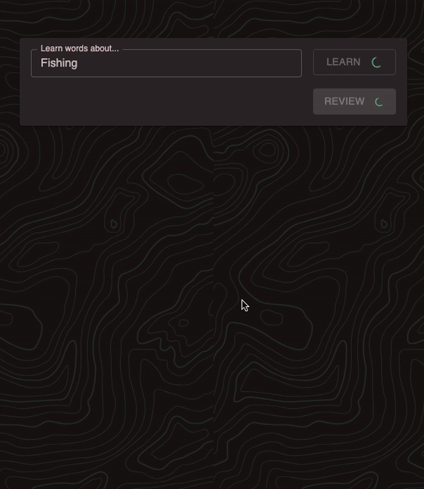

# Foreign Language Flashcard App

A Foreign Language Flashcard App built using Python and Langchain, enhanced with the intelligence of GPT-4.

  

## System prerequisites

- `poetry`
- `pnpm`
- Python v3.11 or greater
- Node v18 or greater

## Installation

1. `cd api && poetry install`
2. Add OpenAI API key is added to `config.py` and language of choice
3. `cd client && pnpm install`

## Running the app locally

#### Database

`docker compose -f docker-compose.database.yml up`

#### API service

`cd api && poetry run uvicorn src.ricotta.main:app --reload`

#### Client web app

`cd client && pnpm dev`

## Running the app in a container

`docker compose -f docker-compose.dev.yml up`
